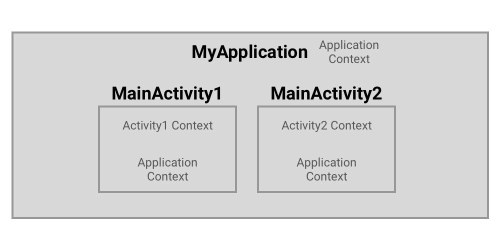

# 안드로이드의 Context

## Context의 사전적 정의

- 맥락, 전후 사정을 의미하며 어플리케이션에 대해서 현재 상태를 나타내는 역할을 한다.

## Android Context

- 애플리케이션 환경에 대한 글로벌 정보를 가지는 인터페이스이다.
- 어플리케이션의 현재 상태를 가지고 있다.
- 시스템이 관리하고 있는 액티비티, 어플리케이션의 정보를 얻기 위해 사용한다.
- 안드로이드 `시스템 서비스에서 제공하는 API`에 접근하기 위해 사용한다.
  - (리소스, DB, Shared Preferences 등)
- Activity, Application 클래스는 Context 클래스를 상속받은 클래스이다.

```
Context는 안드로이드 앱 개발에 있어 필수적인 사항이고, 
매우 중요하기 때문에 이를 정확히 이해하고 올바르게 사용하는 것이 중요하다.
Context의 잘못된 사용은 **메모리 릭 문제**로 이어질 수 있기 때문에 주의해야 한다.
```

### Application Context

- Activity에서 applicationContext라는 프로퍼티를 통해 얻을 수 있는 싱글톤 인스턴스이다.
- 어플리케이션 라이프사이클과 묶여있어, 아래와 같은 작업에 용이하다.
  - Context가 종료되고 나서도 Context가 필요한 작업
  - 액티비티 범위를 벗어난 곳에서 Context가 필요한 작업
- 잘못 된 Context를 참조한 경우
  - 애플리케이션 내에 싱글톤 객체를 만들 때 Context를 주입하는 경우
  - -> 이러한 상황에 Activity Context를 넘겨주면, Activity에 대한 참조를 메모리에 남겨둠
  - -> **GC** 되지 않은 채 메모리 릭이 발생
- 오랫동안 지속되거나 앱 전역에서 사용될 경우 Application Context를 활용한다.

### Activity Context

- 액티비티 안에서만 사용 가능한 Context
- 특정 Activity의 라이프 사이클에 종속되어 있다.
- Activity 스코프 내에서 사용될 때 넘겨주거나, Activity와 라이프사이클이 같은 객체를 생성할 때 넘겨준다.
- Activity가 소멸되면 함께 사라진다.




### Application Context 를 사용하면 안되는 경우

- **Application Context는 Activity Context가 지원하는 모든 것을 지원하지 않는다.**
- GUI (View Component 등..) 관련 동작에서 Application Context는 오류를 발생할 확률이 높다.
  - ex> Application Context로 AlertDialog를 show()한 경우
- Activity는 Garbage Collection이 가능하지만, Application은 앱 프로세스가 살아있는 동안 계속해서 남아있다.
  - Application Context를 활용한 객체를 메모리에서 할당 해제하지 않는 경우 메모리 릭이 발생할 확률이 높다.

### 핵심 내용

- 항상 가장 가갑고 밀접한 스코프의 Context를 골라서 사용한다.
- 액티비티 내부 -> Activity Context
- 어플리케이션 전역(싱글톤) -> Application Context

### 용어 정리
- `GC` : Garbage Collected으로 유효하지 않은 메모리를 알아서 해제해줌
- `메모리 릭` : 컴퓨터 프로그램이 필요하지 않은 메모리를 계속 점유하는 현상

